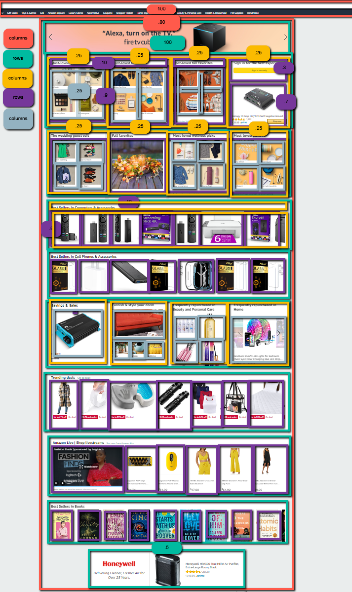

;

<!-- My wireframe got a little out of control. -->

### The basic plan:

1. HTML (using CSS grid)
    1. Create two sections> header: 100% 30px high, products: 80%, 2000px high.
    2. Create 10 rows within product section, all 200px high
    3. Create columns withing rows!
    4. create rows within columns!
    5. maybe create more columns
    6. add photos
